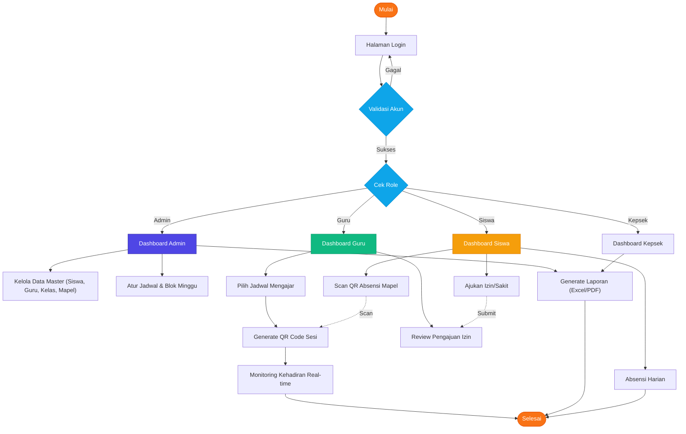

# Flowchart Alur Aplikasi School Absensi

Dokumen ini berisi diagram alur (flowchart) komprehensif untuk sistem absensi sekolah. Untuk melihat versi visual yang lebih interaktif, silakan buka file [flowchart-visual.html](file:///d:/pkl/app%20absensi/flowchart-visual.html) di browser Anda.

## Alur Sistem Terintegrasi

